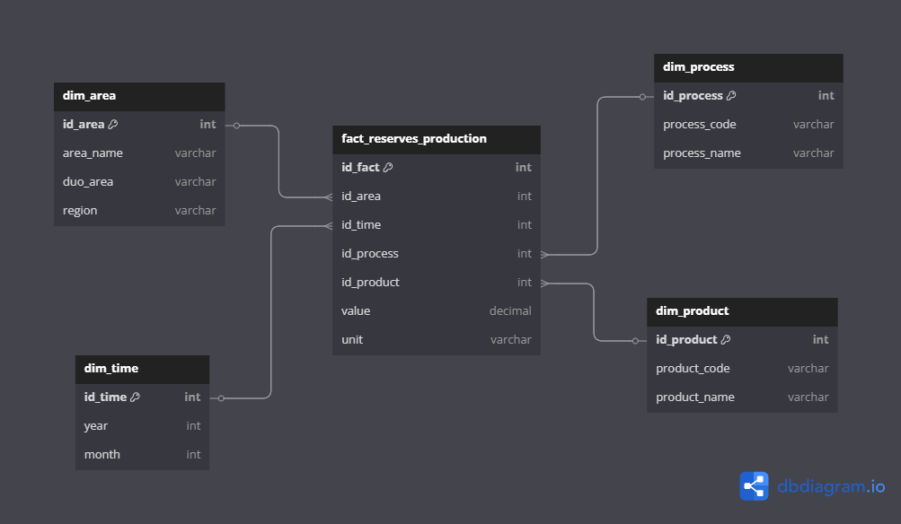

# 📄 EIA Crude Reserves & Production Pipeline - Versioning

## 🗂 **Proyecto**
Pipeline de extracción, transformación y carga (ETL) de datos de reservas y producción de crudo desde la API de la **U.S. Energy Information Administration (EIA)** hacia un Data Warehouse simulado.

## 🛢 **Descripción de los datos**
Este pipeline procesa datos que incluyen:

✅ Reservas anuales y mensuales de **crudo** y **condensados de arrendamiento (lease condensate)**.  
✅ Reservas **en producción** y **no productivas**.  
✅ Información de **producción de crudo**.  
✅ Actividad en el **Golfo de México** y **zonas federales offshore**.  
✅ Datos sobre **pozos**, **actividad de perforación** y **exploración**.

Estos datos permiten analizar la evolución y distribución de la industria petrolera en Estados Unidos y áreas de interés estratégico.

---

## 🗺 **Modelo Dimensional (Star Schema)**

- **fact_reserves_production** como tabla de hechos
- Dimensiones:
  - `dim_area`
  - `dim_time`
  - `dim_process`
  - `dim_product`

---

## 📌 **Estructura de Versionamiento**
| Archivo                                      | Versión | Descripción                                                                           |
|----------------------------------------------|--------|----------------------------------------------------------------------------------------|
| `eia_api_client.py`                          | v1.0   | Cliente API modularizado para conexión con EIA y carga directa a Spark DataFrame.     |
| `config.py`                                  | v1.0   | Archivo de configuración central de parámetros, rutas y API base URL.                 |
| `.env`                                       | v1.0   | Archivo de variables de entorno, almacena la API_KEY y credenciales de correo.        |
| `.gitignore`                                 | v1.0   | Define exclusiones como `.env`, archivos `.ipynb_checkpoints/`, `DL/`, y `DWH/`.      |
| `load_eia_dl.ipynb`                          | v1.0   | Notebook de carga de datos crudos al Data Lake (DL) en CSV.                           |
| `load_eia_dwh.ipynb`                         | v1.0   | Notebook de transformación y carga a Data Warehouse (DWH) en CSV.                     |
| `eia_crude_reserves_production_pipeline.yml` | v1.0   | YAML del pipeline que orquesta la carga desde DL a DWH con validaciones de output.    |
| `run_pipeline.py`                            | v1.0   | Script de ejecución automática con alertas por correo ante fallos.                    |

---

## 🔄 **Estrategia de Versionamiento**
- **v1.0** → Primera versión funcional completa del pipeline:
  - Extracción de datos desde API EIA.
  - Almacenamiento en DL (Data Lake) y posterior transformación en DWH (Data Warehouse).
  - Manejo de errores y validaciones.
  - Envío de alertas por correo.
  - Uso de variables de entorno para seguridad.

---

## 🚀 **Próximos cambios sugeridos para v1.1+**
✅ Implementar versionamiento en los nombres de archivos DL y DWH.  
✅ Modularización de notebooks a scripts `.py` para producción.  
✅ Incorporación de pruebas unitarias para el cliente API.  
✅ Exportación a formatos optimizados como Parquet.
✅ Incorporar más APIS

---

## 🔒 **Seguridad**
- `.env` no versionado, contiene la `API_KEY` y credenciales de correo.
- `.gitignore` asegura que no se suban datos sensibles ni archivos temporales.

---

## 🗓 **Última actualización:** Marzo 2025  
